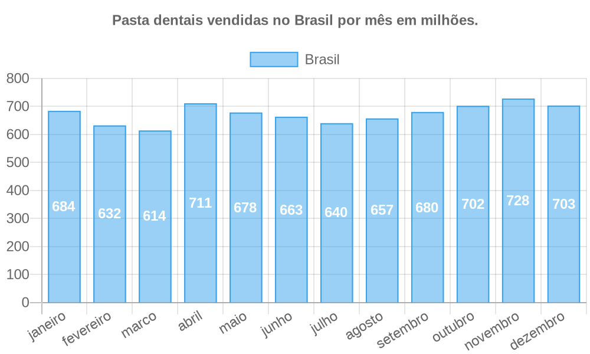

# Santander Coder Bootcamp & Let's Code

Trabalho desenvolvido durante o bootcamp, constitui em desevenvolver o case de quantas pastas dentais são vendidas no Brasil por mês ?

Foi usado um dataset fictício, para simular os dados e montar a tabela. Está tudo documentado nesse [jupyter-notebook](https://github.com/CristianoSantan/data_science_pasta_dental/blob/master/case_pasta_dental.ipynb).

Utilizando a API da [Quickchart](https://quickchart.io/).

Obteve o resultado de um gráfico a seguir com as informações.

